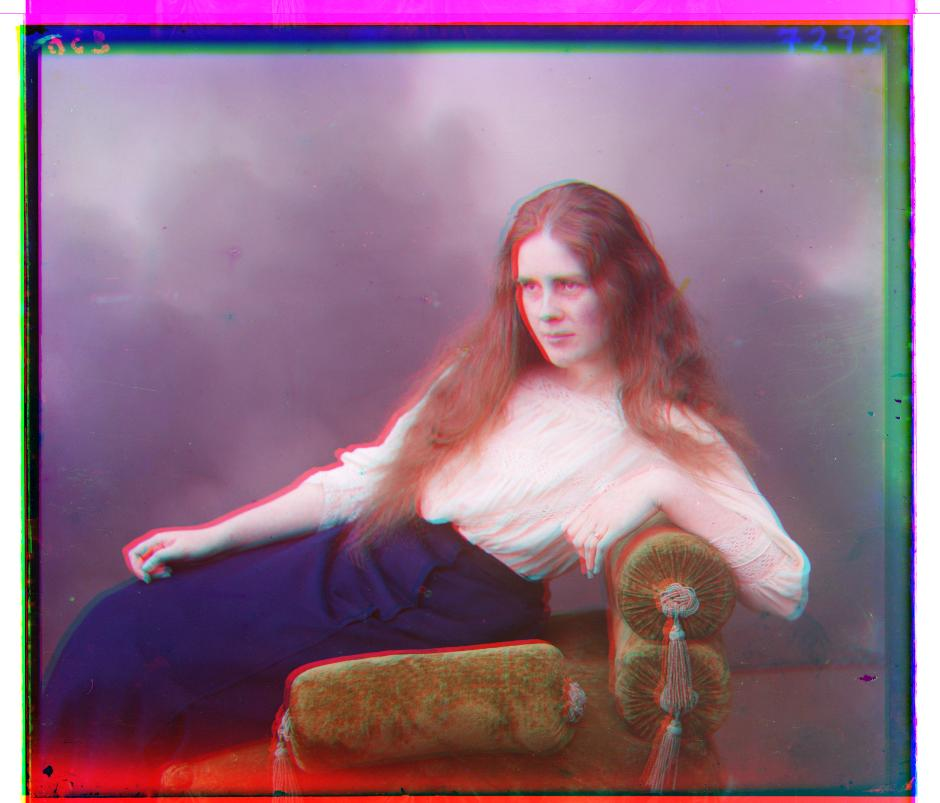

# Assignment #1 - Colorizing the Prokudin-Gorskii Photo Collection

### Overview:

This project focuses on aligning and reconstructing images from their constituent color channels. The primary goal is to take an image that has been split into its red, green, and blue components, align these components accurately, and then reconstruct the original image. 

### Approach:

1. **Image Splitting**: The input image is first converted to grayscale, and then split into three equal parts, each corresponding to one of the RGB channels. This is necessary because the input images are stacked vertically.
2. **Alignment**: The core of the project lies in aligning the split images. Below are the two main metrics are used for alignment:
   - **Sum of Squared Differences (SSD)**: This metric calculates the sum of the squared intensity differences (raw pixel values) between two images. It's used to find the displacement where the difference between the images is minimal.
   - **Normalized Cross-Correlation (NCC)**: NCC measures the similarity between two images. It's particularly useful when the images might have different brightness or contrast levels.

​	In my case I have experimented with both of them and used SSD as the default metric. 

3. **Pyramid Alignment**: To optimize the alignment process, a pyramid approach is employed. This involves creating scaled-down versions of the images and performing the alignment starting from the smallest scale. This approach significantly reduces computation time by narrowing down the possible displacement range as the scale increases.

4. **Reconstruction**: Once the images are aligned, they are reconstructed into a single image by stacking the aligned RGB channels.
5. **Optimization and Challenges**:
   - **Handling Large Images**: For images larger than a certain threshold, the alignment process can become computationally expensive. The pyramid approach helps mitigate this by reducing the image size and thus the search space for alignment.
   - **Edge Cases**: Certain images, especially those are smaller in size, do not benefit from the pyramid approach. For these images, direct alignment without scaling is performed.
   - **Image Quality**: The quality of the reconstructed image heavily depends on the accuracy of the alignment. Misalignments can lead to color fringing or ghosting. To address this, the alignment functions were carefully tested and optimized for accuracy.
   - Challenges Encountered:
     - **Varying Image Sizes**: Handling images of different sizes and aspect ratios required implementing a dynamic approach to splitting and aligning the images.
     - **Optimization**: Initially, the alignment process was slow for large images. Implementing the pyramid approach improved performance.
     - **Accuracy**: Ensuring the alignment was accurate across a variety of images was challenging. This required fine-tuning the parameters and occasionally adjusting the approach based on the image characteristics.

### Aligned Images:

> 

<figure>
  Aligned Image of the Cathedral</figcaption>
</figure>

<figure>
  
  <figcaption>Aligned Image of the self_portrait</figcaption>
</figure>

<figure>
  
  <figcaption>Aligned Image of the emir</figcaption>
</figure>

<figure>
  
  <figcaption>Aligned Image of the three_generations</figcaption>
</figure>

<figure>
  
  <figcaption>Aligned Image of the harvesters</figcaption>
</figure>

<figure>
  
  <figcaption>Aligned Image of the train</figcaption>
</figure>

<figure>
  
  <figcaption>Aligned Image of the icon</figcaption>
</figure>

<figure>
  
  <figcaption>Aligned Image of the turkmen</figcaption>
</figure>

<figure>
  
  <figcaption>Aligned Image of the lady</figcaption>
</figure>

<figure>
  
  <figcaption>Aligned Image of the village</figcaption>
</figure>

